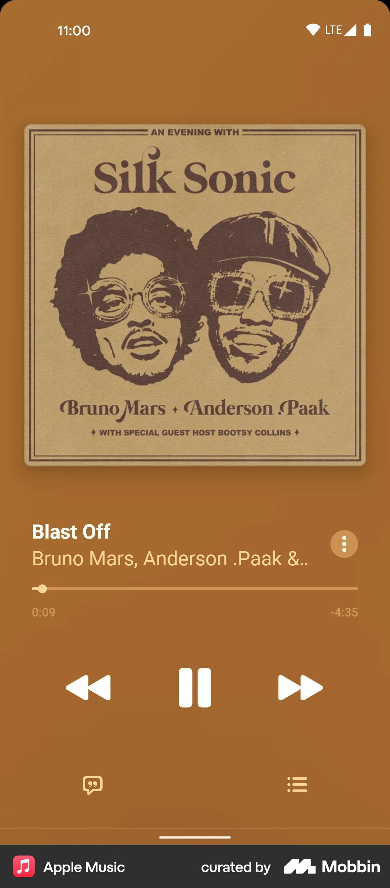

# Welcome to Kalo app 👋

This project is our mobile development course.

All the specifications are on [SPECIFICATIONS.md](./SPECIFICATIONS.md)

## Technologies :
- [Expo](https://expo.dev)
- [Styled components](https://www.styled-components.com/)
- [React Native Track Player](https://rntp.dev/)

## Get started

1. Install dependencies

   ```bash
   npm install
   ```

2. Start the app

   ```bash
    npm run android
   ```

## Design to replicate


